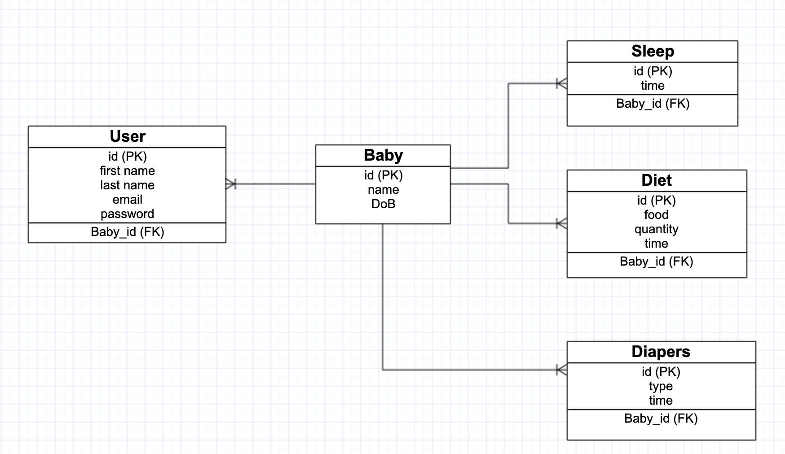
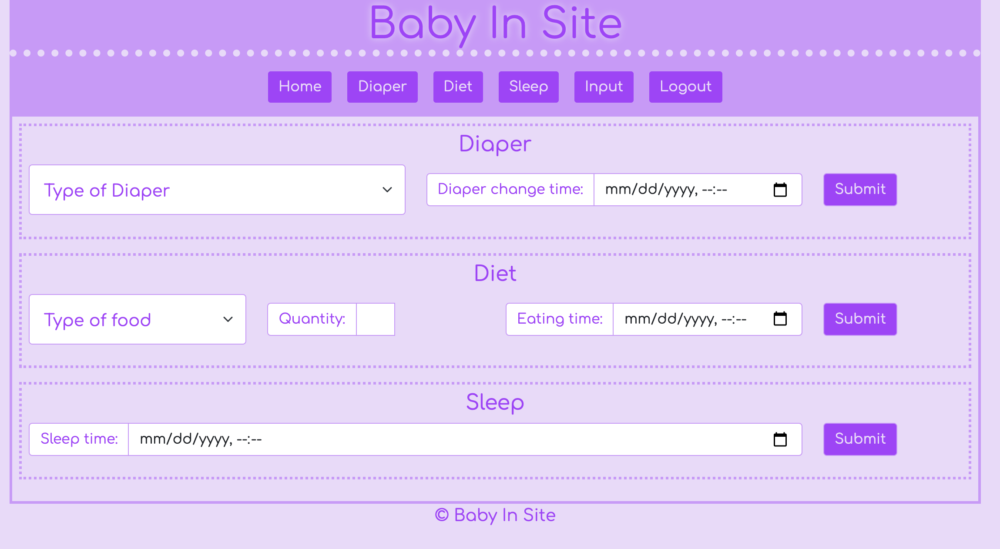
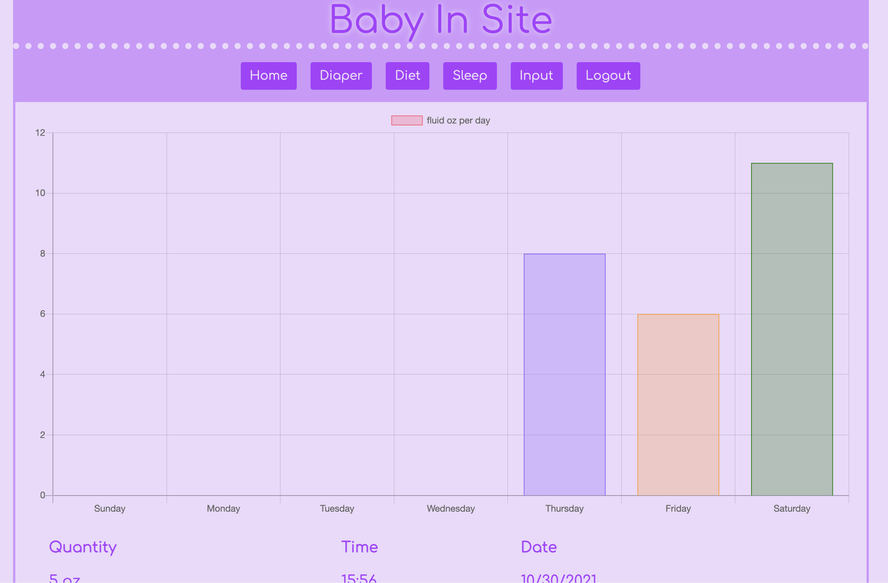

# Babyinsite


## Description

Babyinsite is a web application which allows user to store baby's information. It provides three features, diet, diaper, sleep, which help user records baby's different activity.

## Table of Content

- [User Story](#user-story)
- [Acceptance Criteria](#acceptance-criteria)
- [Model Relationships](#model-relationships)
- [URL Link to GitHub Repository](#url-link-to-github-repository)
- [URL link to deploy in Heroku](#url-link-to-deploy-in-heroku)
- [Mock-Up Image](#mock-up-image)
- [Requirements](#requirements)
- [Installation](#installation)
- [Contribution](#contribution)
- [License](#license)
- [Presentation](#presentation)

## User Story

```
AS A parent who records data about my child
I WANT an easy way to input data and view information
SO THAT I can gain insight into their patterns and better meet their needs
```

## Acceptance Criteria

```
GIVEN a mobile-first, responsive MVC site
WHEN I visit the site for the first time
THEN I am presented with the option to sign up or log in
WHEN I sign up
THEN I am taken to the baby page which presented with a dropdown menu to select baby or created a new baby information form.
WHEN I log in
THEN I am taken to the homepage which includes aggregate data about the current state of my child, navigation links button for diaper, diet, sleep, input and logout
WHEN I click on the diapers button
THEN I am presented with a bar chart display baby's diaper change information for last 7 days
WHEN I click on the diet button
THEN I am presented with a bar chart display baby's diet information about bottle food for last 7 days
WHEN I click on the sleep button
THEN I am presented with a pie chart display baby's sleep and awake hours for yesterday
WHEN I click on the input button
THEN I prompted to update diaper, diet, sleep data in each form
WHEN I click the logout button
THEN I am taken back to the login page
```

## Model Relationships



## URL Link to GitHub Repository

https://github.com/brouiller/babyinsite

## URL link to deploy in Heroku

https://babyinsite.herokuapp.com/

## Mock-Up Image






## Requirements

```
Node.js
npm
```

## Installation

```
npm i
```

## Contribution

- Bradley K. [github profile](https://github.com/brouiller)
- Joey P. [github profile](https://github.com/JoeyGitsIt)
- Jing W. [github profile](https://github.com/jingwang6028)

## License

This project is licensed under the MIT license.

## Presentation

[Project Presentation](https://docs.google.com/presentation/d/10o8Qz0OXkdqnn8beGt_bT3jjWPvZXWe1jE3LSwX-ARI/edit#slide=id.gf1a6abc6fd_1_5)
